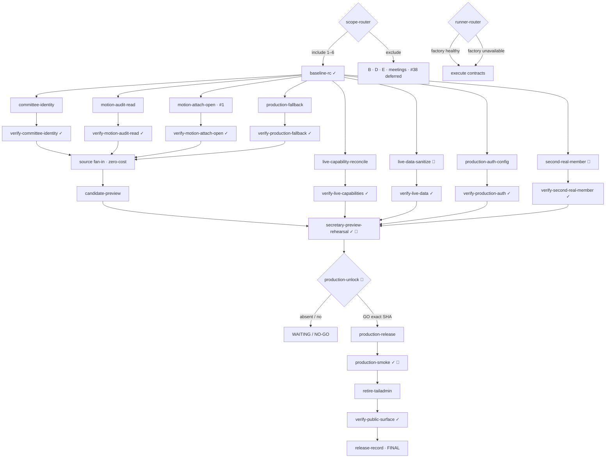

# strata.ai first-Production remainder graph

Generated 2026-08-23 with `.claude/skills/graph-engineering-plan/SKILL.md` and `references/patterns.md`. This graph supersedes the historical phase graph. Its source baseline is fork commit `21fedf7c49b13a0aeb10013ddce8bd9ca6181b07`; its evidence audit is `GRAPH-AUDIT-2026-08.md`.

## Verdict

The source is a credible release candidate, not a Production-ready committee product. Four independent product fixes and four independent live/operations tracks can run in parallel. They converge at one exact-candidate Preview rehearsal with the real secretary and second real member. Only a later explicit operator GO opens the Production edge. The last serial tail is dedicated Production deployment → Production smoke → retirement of the old TailAdmin surface.

The old six-phase chain was mostly stale. Consolidation, frontend replacement, auth plumbing, motion lifecycle, approvals, empty motions, Eve scaffolding, and the CI harness already exist on the authoritative fork tip. Re-running those as build phases would spend effort without producing new artifacts. Current work is narrower and more consequential: close the four source gaps, reconcile the actual live boundary, prove two real people, then release one immutable candidate.

Tracks B, D, E, meetings, and notifications #38 do not fan into v1. Decision routers already exclude them. Pending decisions #1–#2 and #9–#10 therefore cannot hold first Production hostage.

## Edge audit

### Stale graph edges removed

| Claimed/historical edge | Classification | Evidence and disposition |
|---|---|---|
| `consolidate → local-gate → preview-1` | **Obsolete real edge** | Consolidation is in fork tip `21fedf7`; exact-tip fork CI passed all five jobs. Preserve CI as `baseline-rc`, do not rebuild a completed prefix. |
| `auth-harden → frontend journeys` | **Satisfied edge** | Active-member fail-closed auth and role-aware frontend/API integration are present. The remainder consumes those contracts; it does not recreate them. |
| `frontend → Track B → Track D` | **Fake and now excluded** | Email ingest and Eve drafts carry no data required by the six-part first-Production bar. Decisions route both away from v1. |
| `meeting-mode/register → rehearsal` | **Policy-excluded** | Decision #7 is No. No meeting or mailbox output enters rehearsal. |
| `Track E → rehearsal` | **Policy-excluded** | Decision #8 is `defer-track-e-post-v1`. Finance has no v1 fan-in. |
| Historical Lajij issue completion → live proof | **Fake** | Closed issues prove provenance, not fork-tip runtime or live database state. Current fork CI plus current live verification are the admissible evidence. |

### Remainder edges scored

| Proposed edge | Classification | What crosses the edge |
|---|---|---|
| `baseline-rc → {committee-identity, motion-audit-read, motion-attach-open, production-fallback}` | **Real shared input** | Exact source revision and current contracts. The four makers do not consume one another and run in isolated worktrees. |
| Any one source maker → another source maker | **Fake** | No output crosses. Serializing them only creates merge delay. |
| Each maker → its named verifier | **Real gate** | Changed tree plus the issue's output contract. Maker never grades itself. |
| Source verifiers → `candidate-preview` | **Real fan-in** | Only reviewed, gate-passing source may become the immutable candidate. The fan-in/reduce itself is zero-cost mechanical wiring. |
| Live capability reconcile → source builds | **Fake** | Database state does not construct source. Rehearse against repository migrations; apply/verify live in parallel. Runtime data never feeds build-time construction. |
| `live-capability-reconcile → verify-live-capabilities` | **Real** | Migration ledger, function definitions, triggers, grants, and policy manifest. |
| `live-data-sanitize → verify-live-data` | **Real** | Exact targeted change record and post-change read-only snapshot. A broad fixture-reconcile migration is explicitly not an input. |
| `production-auth-config → candidate source build` | **Fake** | Auth settings do not build code. They do gate real invite/recovery and final Production smoke. |
| `second-real-member → candidate-preview` | **Fake** | The member row does not build/deploy code. Onboarding may start on the stable Preview while source work runs. |
| `{source gates, live gates, auth gate, real member} → secretary-preview-rehearsal` | **Real barrier** | One exact candidate, clean real workspace, hardened policies, working callbacks, and two real identities are all consumed by the rehearsal. |
| `secretary-preview-rehearsal → production-unlock` | **Real evidence edge** | Signed acceptance evidence, residual-risk list, exact commit/deployment ID, and rollback plan. |
| `production-unlock → production-release` | **Policy gate** | Explicit operator authorization; no build can manufacture it. `no`/absent routes to WAITING. |
| `production-release → production-smoke` | **Real** | Dedicated hostname and immutable deployed candidate. |
| `production-smoke → retire-tailadmin` | **Real safety edge** | A healthy replacement must exist before the old public surface is redirected/removed. |
| `retire-tailadmin → verify-public-surface` | **Real** | Changed public routing/deployment state. |
| Every passed verifier → `release-record` | **Real terminal reduce** | Evidence pointers only. The reduce is mechanical and zero-cost. |
| GitHub/Foreman health → product work | **Fake** | It chooses a runner, not product topology. A human or later agent can execute the same contracts. |

The only broad barrier that survives is the exact-candidate rehearsal. It earns its wait because it is the first node that consumes every in-scope boundary together.

## Node inventory

Tiers: **C** = cheap/mechanical; **S** = strong engineering judgment; **H** = human/operator action. A verifier is a distinct node even when it shares the maker's one-concern GitHub issue.

| Node | Job | Input | Output contract | Tier | Issue |
|---|---|---|---|---|---|
| `scope-router` | Freeze v1 fan-in | Decisions #4–#10 | Include vision 1–6; exclude B/D/E/meetings/#38; retain pending decisions only on deferred tracks | H; **done** | Decision record, no issue |
| `runner-router` | Select available executor | GitHub/Foreman connection state | Factory if healthy; otherwise human/later agent using the same graph, with no topology change | C; **done** | Operational router, no issue |
| `baseline-rc` | Pin authoritative source and admissible CI | Fork branch tip | SHA `21fedf7…`; fork CI run 32526860349 green; audit snapshot | C; **done** | Baseline, no issue |
| `committee-identity` | Put the authenticated member's real committee identity into the RLS-scoped app contract and shell | `baseline-rc`; current-member committee id | Payload/UI show `SP 6430 - 33 Malvern Avenue` and address; no generic building name; signed-out remains empty | S | [#2](https://github.com/jjlecocq-v/strata.ai/issues/2) |
| `verify-committee-identity` | Independently attack identity/tenant rendering | Maker commit; two committee personas; signed-out persona | Contract/type test + Playwright proof of correct name for each tenant, no cross-tenant label, and signed-out lock | C run / fresh-eyes S | #2 |
| `motion-audit-read` | Return the persisted audit rows already written for each motion | `baseline-rc`; audit schema | App-data selects/maps `motion_id`; drawer shows only that motion's events | C | [#3](https://github.com/jjlecocq-v/strata.ai/issues/3) |
| `verify-motion-audit-read` | Prove create/open/approval/decide events survive fetch and isolation | Maker commit; local Supabase | Behavioural HTTP/UI journey plus cross-committee negative; no source-string-only pass | C run / fresh-eyes S | #3 |
| `motion-attach-open` | Implement v1 attach and open on a motion | Fork issue #1; existing private bucket/document route; motion schema | Additive motion↔document relation, RLS-scoped upload/attach, motion drawer list, time-limited open path, and no broader N4 work | S | Existing [#1](https://github.com/jjlecocq-v/strata.ai/issues/1) |
| `verify-motion-attach-open` | Attack storage, relation, and tenant boundary | Maker commit; representative text/PDF; two committees | Upload from motion, reload, open exact bytes, expired/hidden/cross-tenant denial, cleanup in isolated CI | S author / C run | #1 |
| `production-fallback` | Make locked verified fallback a valid Production mode without fixture substitution | Decision #5; current AI context/route | Production accepts explicit fallback; active-member RLS context only; bounded output visibly identified; live mode remains opt-in/fail-closed; README agrees | S | [#4](https://github.com/jjlecocq-v/strata.ai/issues/4) |
| `verify-production-fallback` | Prove Production-mode config and adversarial data isolation | Maker commit; production-like build env; personas | Config/build test, signed-out/inactive denial, hidden-record denial, no mock app fixtures, no Gateway call, live-mode credential failure still non-2xx | S author / C run | #4 |
| `live-capability-reconcile` | Apply the missing capability/attribution hardening exactly and non-destructively | Reviewed `202608160001…sql`; attested project; backup/recovery plan; isolated rehearsal | Migration ledger records one reviewed migration; expected helpers/search paths/triggers/grants/policies exist; old replaced policies absent | S ops | [#5](https://github.com/jjlecocq-v/strata.ai/issues/5) |
| `verify-live-capabilities` | Independently compare expected versus actual live security boundary | Repository migration; post-apply catalog; six persona matrix | Schema manifest diff passes; direct Data API/RLS negative matrix passes in isolated staging; Production gets non-mutating sentinels only | S | #5 |
| `live-data-sanitize` | Remove/quarantine only known seed/test records from the real committee | Exact reviewed IDs; backup/export; operator targeted-cleanup unlock | JJ and committee retained; known test members and fixture cards no longer active/visible; no reset or committee-wide predicate | H+S ops | [#6](https://github.com/jjlecocq-v/strata.ai/issues/6) |
| `verify-live-data` | Prove sanitation did not damage the real workspace | Before/after manifests | Committee/JJ/storage/law remain; motions are honestly empty; known titles/test emails absent; diff contains only approved IDs | Independent S | #6 |
| `production-auth-config` | Prepare and apply the Production authentication boundary | Named Production hostname; Vercel target access; Supabase Auth access | Production Site URL/redirect allowlist covers sign-in, invite, `/recover`; leaked-password protection enabled if plan supports it; no wildcard surprise | H+S ops | [#7](https://github.com/jjlecocq-v/strata.ai/issues/7) |
| `verify-production-auth` | Inspect callbacks and recovery without mailbox dependence | Auth settings; Preview/Production origins | Read-back of exact allowlist; generated one-time recovery-link verifier on non-Production target; Production sentinel is non-mutating | Independent S | #7 |
| `second-real-member` | Invite/add one genuine SP 6430 member | Real member email/name/role supplied by operator; stable approved origin | Invite sent once; person accepts; live member becomes active and linked; no seed identity counted | H | [#8](https://github.com/jjlecocq-v/strata.ai/issues/8) |
| `verify-second-real-member` | Confirm two independent humans and attributed permissions | JJ session; second-member session | Each sees only SP 6430; second member can record own approval; identities differ; invite callback succeeds | H, fresh eyes | #8 |
| `candidate-preview` | Merge only passing source nodes and deploy an immutable Preview | Four passed source gates; clean branch | Preview URL, deployment ID, commit SHA, runtime attestation; no Production target/mutation | C ops | [#9](https://github.com/jjlecocq-v/strata.ai/issues/9) |
| `secretary-preview-rehearsal` | Exercise the six-part flow against the exact candidate | Candidate Preview; passed live/auth/member gates | Signed-out lock; JJ sees exact committee and honest empty motions; attach/open; 0–0 failed probe; two-person passed/failed approval; tenant negative; clean console/a11y; evidence bundle | H + adversarial S | #9 |
| `production-unlock` | Decide whether the exact candidate may enter Production | Rehearsal bundle; rollback plan; residual risks | Explicit operator `GO <sha> <deployment-id> <hostname>` or `NO-GO`; absent answer = WAITING | H | Policy gate, no separate concern |
| `production-release` | Establish the dedicated committee Production surface | Explicit GO; exact candidate; configured auth; rollback target | Dedicated Production URL serves the named SHA; live fail-closed env; no Preview-share dependency; rollback procedure recorded | H+S ops | [#10](https://github.com/jjlecocq-v/strata.ai/issues/10) |
| `production-smoke` | Independently verify the released boundary without destructive test data | Dedicated URL; two real sessions | Signed-out lock/recover; committee identity; existing accepted motion/document/approval evidence readable; nonmember denial; runtime attestation; clean console | H, fresh eyes | #10 |
| `retire-tailadmin` | Remove or redirect the unrelated old public demo | Passed `production-smoke`; control of old Vercel project/domain | `strata-ai.vercel.app` redirects to the dedicated URL or no longer serves TailAdmin | H+S ops | [#11](https://github.com/jjlecocq-v/strata.ai/issues/11) |
| `verify-public-surface` | Check both public entry points from a signed-out browser | New and old URLs | New URL passes locked surface; old URL cannot expose TailAdmin; redirects have no loop; recovery remains reachable | C + fresh-eyes S | #11 |
| `release-record` | Reduce all evidence into the terminal state | Every in-scope verifier | `GRAPH-STATE.md` all in-scope nodes done, issue/PR/deployment pointers, residual risks; no deferred node mislabelled shipped | C | Mechanical terminal reduce, no issue |

### Issue contract rule

Each titled concern above is one narrow fork issue. Maker and verifier nodes share that issue because they are two roles around one output contract, not two concerns. Routers, policy gates, and the terminal evidence reduce do not get synthetic tickets. Every issue body must include: evidence citation, exact output contract, named verifier, hard stops, and “not in scope.” Existing issue #1 is updated rather than duplicated.

## Topology

Named shapes:

- **Four-arm source diamond:** the four source concerns share only the baseline. Use separate worktrees; merge after their independent gates.
- **Four-arm live/ops fan-out:** live RLS, data sanitation, auth configuration, and second-member onboarding do not consume source-maker outputs. Run them early.
- **Hard fan-in:** `secretary-preview-rehearsal` consumes every in-scope boundary and is the first justified wide barrier.
- **Policy router:** `production-unlock` is a human decision, not an engineering retry.
- **Serial safety tail:** release before smoke, healthy replacement before retiring the old demo.
- **Excluded subgraph:** B/D/E/meetings/#38 has no edge back to v1. This is deliberate, not “pending.”

## Verifiers

1. **Committee identity — behavioural and perspective-diverse.** Add a local two-committee Playwright contract. A fresh-eyes verifier signs in as Committee A, Committee B, outsider, and signed-out; it checks both positive identity and absence of the other committee’s name. A source assertion on the hard-coded string is useful but cannot pass the node alone.
2. **Motion audit — data round-trip.** Create → open → request/respond → decide through HTTP, fetch `/api/app-data`, then assert ordered motion-linked events and zero cross-tenant visibility. `mapAudit` source inspection is not behavioural proof.
3. **Motion document — storage + UI + RLS.** The verifier uploads a real file from the motion, reloads, opens exact bytes through a short-lived scoped mechanism, and attacks hidden/cross-committee IDs. Existing document upload checks are predecessor patterns, not coverage of a relation or open path.
4. **Production fallback — configuration + adversarial scope.** Build with a production-like environment and explicit fallback, then test signed-out, inactive, ordinary, admin, hidden record, and missing record. Assert no app fixture title enters context/output, no Gateway is called, and live mode still fails closed without credentials.
5. **Live capability reconcile — independent schema manifest.** Compare every function signature/search path, trigger, grant, and replaced policy named by the migration. Run mutating six-persona tests only on isolated local/staging; use non-mutating catalog and sentinel queries against live. Static migration greps do not grade the apply.
6. **Live data sanitation — exact before/after diff.** A verifier receives the approved ID list and backup manifest, then rejects any changed row outside it. It checks JJ, committee identity, bucket, motions, and law corpus remain intact.
7. **Production auth — settings read-back and callback proof.** Confirm exact Site URL and redirect entries, no accidental wildcard, and leaked-password setting. Recovery proof uses the existing generated-link pattern without reading mail; never mutate a real Production password for a test account.
8. **Second real member — two human lenses.** The inviter cannot self-certify acceptance. The recipient completes the callback/sign-in, then the verifier confirms distinct Auth/member IDs and an attributed approval.
9. **Secretary Preview rehearsal — release acceptance panel.** One human operates JJ, another the second member, and a skeptical verifier covers outsider/cross-tenant/0–0/console/a11y. Capture commit SHA, deployment ID, runtime attestation, screenshots, created record IDs, and cleanup disposition.
10. **Production smoke/public surface — non-destructive.** Read existing accepted records and exercise signed-out/recovery navigation. Do not create disposable Production committee data. A separate signed-out session verifies the old domain no longer serves TailAdmin.

The mechanical source fan-in and `release-record` reduce do not need model verifiers; they only validate checksums/pointers and fail if any required gate is absent.

## Cycles

| Cycle | Stop/dry rule | Dedupe key | Failure handling |
|---|---|---|---|
| Per-concern maker→verifier repair | Stop on the first passing named gate | `issue + commit SHA + gate name + normalized failure fingerprint`, checked against **all seen attempts** | After two consecutive failures of the same gate, mark that track `blocked(<fingerprint>)`, stop it, and continue independent tracks. Never weaken the gate. |
| Exact-candidate rehearsal | A round is clean only when every six-part criterion passes and no new P0/P1 is found; one clean round is sufficient because inputs are immutable | `candidate SHA + deployment ID + persona + scenario + record IDs` | Any change invalidates the candidate and returns only the affected source/live node to pending. Two consecutive failed rehearsal gates stop the track and yield WAITING with the exact owner. |
| Invite/accept | **No discovery loop.** One invite per named person; stop after delivered/accepted or one diagnosed failure | normalized email hash + committee id + invite generation | Never resend automatically. A second send requires the operator/recipient because email is an external side effect. |
| Production smoke | No retrying around an unhealthy release. One pass; if it fails, use the predeclared rollback procedure | production deployment ID + check name | Halt Production track, preserve evidence, and follow operator-approved rollback. |

There is deliberately **no mailbox cycle**. Decisions #1–#2 are pending and Track B is excluded. There is no finance/photo loop because Track E and decision #9 are excluded.

## Critical path

The binding path is:

`max(source-fix arms, live-RLS, live-data, production-auth, second-real-member) → candidate-preview → secretary-preview-rehearsal → production-unlock → production-release → production-smoke → retire-tailadmin → verify-public-surface → release-record`

The four source arms are:

- `committee-identity → verify-committee-identity`
- `motion-audit-read → verify-motion-audit-read`
- `motion-attach-open → verify-motion-attach-open`
- `production-fallback → verify-production-fallback`

The live/ops arms are independent until rehearsal:

- `live-capability-reconcile → verify-live-capabilities`
- `live-data-sanitize → verify-live-data`
- `production-auth-config → verify-production-auth`
- `second-real-member → verify-second-real-member`

`motion-attach-open` is likely the longest engineering arm. Human response time for the second real member and access to the correct Vercel scope may instead become the elapsed-time bottlenecks. That does not justify serializing the source fixes behind them.

Tracks B/D/E/meetings/#38, the vector-extension warning, richer document extraction, and live Gateway work are off-path. They must not enter `candidate-preview` or rehearsal by accident.

## Unblock-now

These inputs can be resolved immediately and in parallel. Only the named nodes wait; the rest of the graph continues.

1. **Connect GitHub for `jjlecocq-v`.** The GitHub plugin currently exposes tool names but returns `Unknown tool`, and local `gh` credentials are invalid. This blocks issue/branch/PR writes and Foreman, not local execution of the graph.
2. **Reconnect the correct Vercel scope.** The available connector can see `jjlecocq-8964s-projects`, while the target import is in `jjlecocq-8187s-projects`; target inspection returned 403. This blocks Production/auth operations, not source work.
3. **Name the second real member and obtain acceptance.** Supply email, name, intended role/access, and recipient availability. Do not count seed/test identities.
4. **Provide a secretary browser session when requested.** The factory must not ask for or store JJ’s password. A user-controlled signed-in browser is sufficient for the human rehearsal.
5. **Approve the exact sanitation manifest.** The executor must present backup location and exact member/card/Auth IDs. Never run the broad legacy fixture reconciliation or a committee-wide delete.
6. **Choose/confirm the dedicated Production hostname and operator.** This is configuration input, not permission to deploy.
7. **Later only:** after clean rehearsal, issue the explicit Production token `GO <sha> <deployment-id> <hostname>`. Until then `production-release` remains `blocked(operator-production-unlock)`.

Pending Gmail/retention/photo/confirm-figure answers (#1, #2, #9, #10 in `DECISIONS-REQUIRED.md`) are intentionally absent from this list because their tracks are not in v1.

## Execution notes

### Wave 0 — pin and route

- Read `GRAPH-AUDIT-2026-08.md`, this graph, `GRAPH-STATE.md`, and the target issue before work.
- Confirm the head still descends from `21fedf7…`. If the RC tip moved, rerun the audit delta before making code.
- Route B/D/E/meetings/#38 to excluded. Do not wait on decisions that cannot affect v1.
- Choose factory or human execution from current connectivity. Never change node contracts because the runner changed.

### Wave 1 — maximum parallelism

- Use one worktree per source concern. Start `committee-identity`, `motion-audit-read`, `motion-attach-open`, and `production-fallback` concurrently. Each branch changes a narrow surface and owns its tests.
- In parallel, rehearse/apply `live-capability-reconcile`; prepare the exact `live-data-sanitize` manifest; inspect/configure Production auth; begin named second-member onboarding.
- Every concern stops at its independent verifier. Do not merge on “looks good.”

### Wave 2 — exact candidate

- Merge only passed source branches, resolve overlap once, and rerun the entire fork CI matrix. The merge/reduce is mechanical.
- Deploy a Preview only from the exact SHA. Record URL, deployment ID, SHA, runtime attestation, and target=`preview`.
- Finish live/auth/member gates, then run `secretary-preview-rehearsal`. No source change may occur under the same candidate identity.

### Wave 3 — operator-gated Production tail

- Prepare the GO packet: exact SHA/deployment, all verifier evidence, Production hostname/env/auth manifest, rollback target/procedure, and residual risks.
- Without the exact operator GO, print WAITING. Never infer authorization from “continue,” a green CI run, or an earlier Preview approval.
- After GO, deploy/configure the dedicated Production surface, run non-destructive smoke, then retire/redirect the old TailAdmin surface and verify both URLs.
- Finish by updating `GRAPH-STATE.md` and closing only issues whose verifier evidence exists.

### Fork issue set

Create/update these narrow issues on `jjlecocq-v/strata.ai`; do not create Lajij tickets:

1. Existing #1 — **Attach a real document to a motion and open it** (`motion-attach-open` + verifier).
2. [#2 — Display the authenticated committee identity](https://github.com/jjlecocq-v/strata.ai/issues/2) (`committee-identity` + verifier).
3. [#3 — Load the persisted audit history for each motion](https://github.com/jjlecocq-v/strata.ai/issues/3) (`motion-audit-read` + verifier).
4. [#4 — Honor verified AI fallback mode in Production](https://github.com/jjlecocq-v/strata.ai/issues/4) (`production-fallback` + verifier).
5. [#5 — Reconcile capability and attribution hardening on live Supabase](https://github.com/jjlecocq-v/strata.ai/issues/5) (`live-capability-reconcile` + verifier).
6. [#6 — Remove legacy fixture records from the SP 6430 workspace](https://github.com/jjlecocq-v/strata.ai/issues/6) (`live-data-sanitize` + verifier).
7. [#7 — Configure Production auth redirects and password protection](https://github.com/jjlecocq-v/strata.ai/issues/7) (`production-auth-config` + verifier).
8. [#8 — Invite and activate a second real SP 6430 member](https://github.com/jjlecocq-v/strata.ai/issues/8) (`second-real-member` + verifier).
9. [#9 — Run the exact-candidate two-person Preview acceptance](https://github.com/jjlecocq-v/strata.ai/issues/9) (`candidate-preview` + `secretary-preview-rehearsal`).
10. [#10 — Establish the dedicated Strata Production surface](https://github.com/jjlecocq-v/strata.ai/issues/10) (`production-release` + `production-smoke`).
11. [#11 — Retire the public TailAdmin Strata demo](https://github.com/jjlecocq-v/strata.ai/issues/11) (`retire-tailadmin` + verifier).

Issue sync completed on the fork on 2026-08-23. Existing #1 was retained and #2–#11 were created from these contracts.
